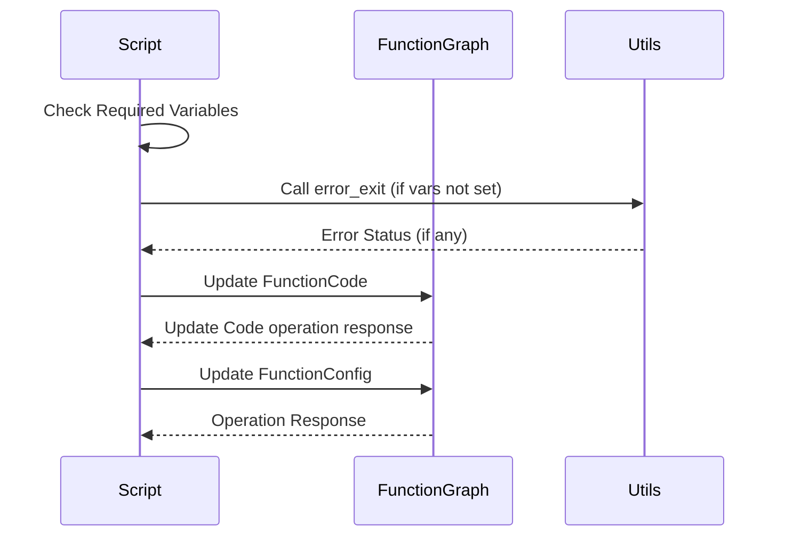

# Huawei Cloud Update FunctionGraph Script
## Description

This Bash script is designed to automate the UpdateCode and UpdateConfig of a function to the Huawei Cloud FunctionGraph service. The script performs a variety of tasks such as environment setup, dependency management, and function deployment. It can also be run using Docker Compose.

## How it works



## Requirements

**Docker 🐳:**
1. Docker and Docker Compose installed.
2. A running Huawei Cloud account and an existing project.

**For Manual Installing:**
1. [koocli](https://support.huaweicloud.com/intl/en-us/qs-hcli/hcli_02_003_02.html) CLI installed.
2. `jq` for JSON manipulation.
3. `expect` for automating interactive tasks.
4. `zip` for compressing the function folder.
5. A running Huawei Cloud account and an existing project.


## Environment Variables


| Variable            | Type       | Example                   | Description                                                                                       |
|---------------------|------------|---------------------------|---------------------------------------------------------------------------------------------------|
| `FUNC_NAME`         | Mandatory  | `myFunction`              | The name of the function.                                                                          |
| `REGION`            | Mandatory  | `la-south-2`              | The region where the function resides.                                                             |
| `PROJECT`           | Mandatory  | `123456789`               | Your Huawei Cloud Project ID.                                                                      |
| `DEPENDENCIES`      | Optional   | `lib1,lib2,lib3`          | A comma-separated list of private dependencies the function needs. They must exist in your Huawei Cloud dependency list; the script will use the first version.|
| `ACCESS_KEY`        | Mandatory  | `AbcD1234EfgH`            | Your Huawei Cloud access key.                                                                      |
| `SECRET_KEY`        | Mandatory  | `XyZ0987WvU`              | Your Huawei Cloud secret key.                                                                      |
| `HANDLER`           | Mandatory  | `index.py`                | The function handler.                                                                              |
| `MEMORY_SIZE`       | Mandatory  | `256`                     | The memory size allocated for the function.                                                        |
| `RUNTIME`           | Mandatory  | `Python3.6`               | The runtime environment for the function (e.g., Python3.6).                                        |
| `TIMEOUT`           | Mandatory  | `30`                      | The timeout for the function execution.                                                            |
| `FUNCTIONGRAPH_*`   | Optional   | `FUNCTIONGRAPH_DEBUG=1`, `FUNCTIONGRAPH_PORT=3000` | Environment variables starting with "FUNCTIONGRAPH_" will be used as function environment parameters.|
| `AGENCY_NAME`       | Optional   | `MyAgency`                | The name of the agency role with permissions.                                                      |
| `DEBUG`             | Optional   | `true` or `false`         | Enables or disables debug mode.                                                                    |
| `FUNCTION_FOLDER`   | Optional   | `/path/to/func`           | Path to the function folder.                                                                       |


## Preparation

1. **Create `function` directory:**

    Create a directory called `function` on your machine. This is where you should place your function code.

    ```bash
    mkdir -p /app/function
    ```

2. **Place function code:**

    Your function code should reside within the `/app/function` directory. It will be zipped and uploaded as part of the deployment process.

## How to Use

### Option 1: Run with Docker Compose 🐳

1. Make sure you have Docker Compose installed.
2. Modify the `docker-compose.yml` and `example.env` files to suit your requirements.
3. Run the script with Docker Compose:

   ```bash
   docker-compose up
   ```

### Option 2: Run the script manually 🧰🔨

1. **Download the script:**

   Use `curl` or `wget` to download the raw script:

   ```bash
   curl -O https://raw.githubusercontent.com/Buronn/huaweicloud-update-functiongraph-script/main/entrypoint.sh
   ```
   Or
   ```bash
   wget https://raw.githubusercontent.com/Buronn/huaweicloud-update-functiongraph-script/main/entrypoint.sh
   ```

2. **Make the script executable:**

   ```bash
   chmod +x entrypoint.sh
   ```

3. **Set environment variables:**

   You can either export them in your shell session or put them in a `.env` file.

   ```bash
   export FUNC_NAME="my_function"
   export REGION="cn-north-4"
   export PROJECT_ID="your_project_id"
   # ... (set all required variables)
   ```

   Or, in a `.env` file:

   ```env
   FUNC_NAME=my_function
   REGION=cn-north-4
   PROJECT_ID=your_project_id
   # ... (set all required variables)
   ```

   If you use a `.env` file, make sure to source it:

   ```bash
   source .env
   ```

4. **Run the script:**

   ```bash
   ./entrypoint.sh
   ```
## Troubleshooting

- Make sure you have all required CLI tools installed (`koocli`, `jq`, `expect`, `zip`).
- If using Docker Compose, ensure that Docker Compose is installed.
- Ensure all environment variables are set before running the script.
- Check the log messages carefully to diagnose any issues.

## Contribute 🤝

We welcome contributions! If you find a bug or would like to propose a new feature, please feel free to open an issue or submit a pull request.

- **Report Bugs:** If you find any issues or bugs, please report them by opening a new issue on the GitHub repository.
- **Feature Requests:** If you have an idea for a new feature, feel free to open an issue describing the feature and why it would be useful.
- **Pull Requests:** Contributions via pull requests are highly appreciated.

## License

This script is released under the MIT License.
